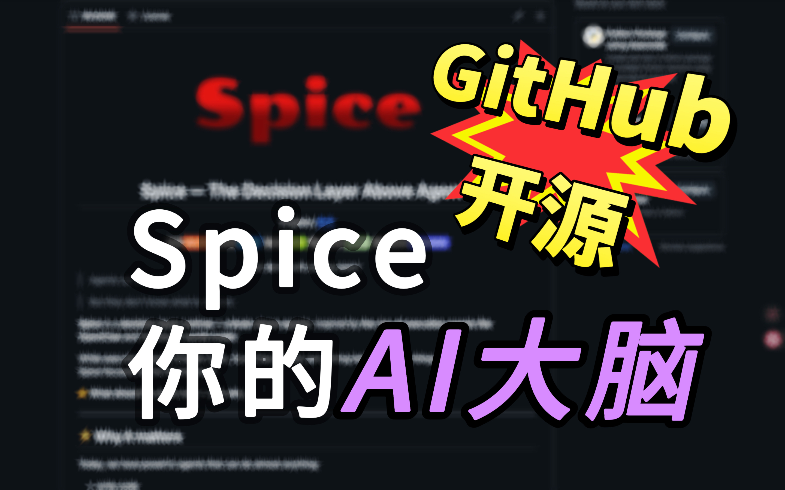
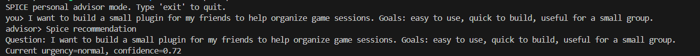
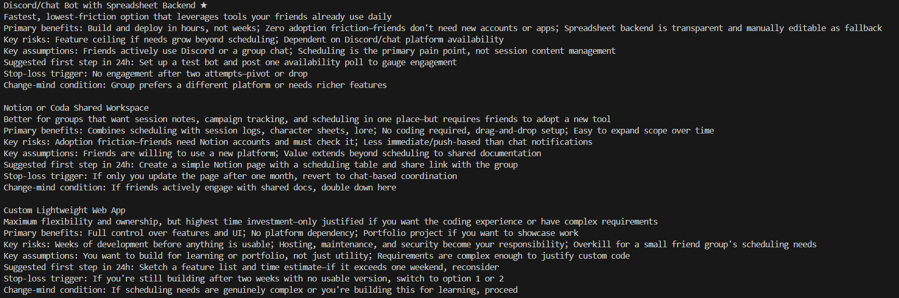
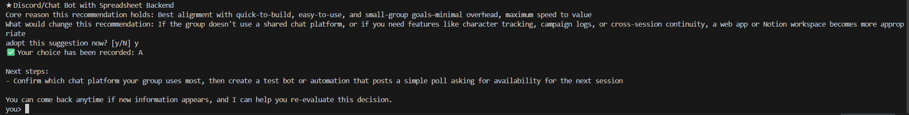
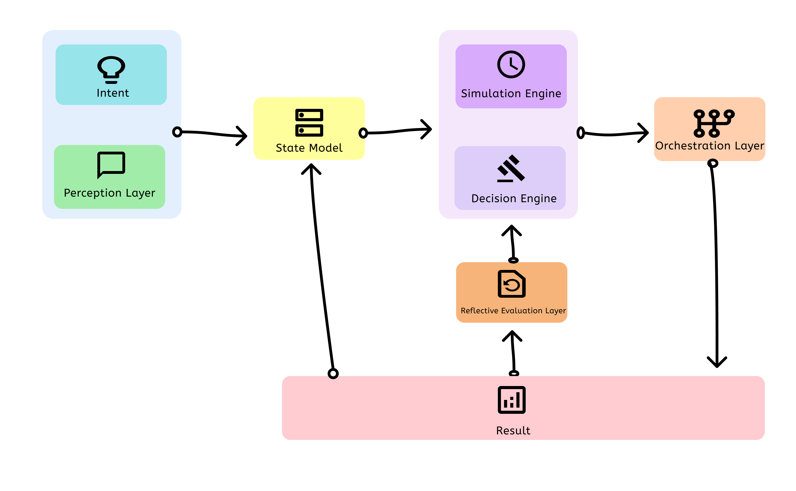
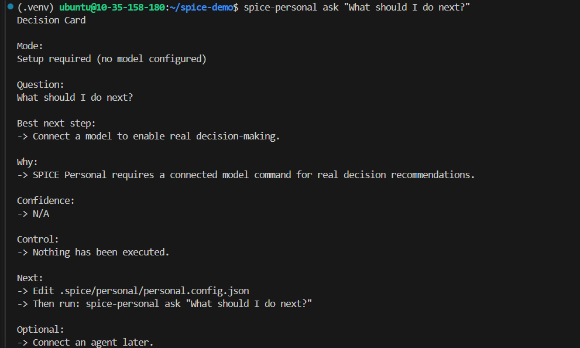

<div align="center">
  
  <h1>Spice — The Decision Layer Above Agents</h1>

  
  <p>
    <strong>English / <a href="./README_zh.md">中文</a></strong>
  </p>
  
  <p>
    <a href="https://pypi.org/project/spice-runtime/"></a>
    
    
    <a href="./COMMUNICATION.md"></a>
    <a href="https://discord.gg/DajVWWNMfE"></a>
  </p>
  
</div>


> Agents can **execute**. 

> But they don’t know what to do next.

**Spice** is a **decision-layer runtime — a brain above agents.** inspired by **the rise of execution agents like OpenClaw** and the idea of **world model**.

While execution agents (Claude Code, OpenClaw, Codex) are getting better at doing things,  
Spice focuses on the missing layer:

👉 **What should be done next — and why.**

---

## Demo of Spice：
To gain a more intuitive understanding of Spice, 

please visit our carefully prepared demo about conflicts between life and work events: [Spice-live-demo](https://666ghj.github.io/mirofish-demo/)

---
### Demo Video

<div align="center">
<a href="https://www.bilibili.com/video/BV1VYBsBHEMY/" target="_blank"></a>

Click the image to watch the full demo video of using Spice to handle conflicts between the digital and physical worlds.
</div>

---

## ⚡ Why it matters

Today, we have powerful agents that can do almost anything:

- write code  
- analyze data  
- automate workflows

But when you sit down to use them, you still face the same problem:

**What should I do next?**

That’s the hard part.

The real bottleneck is:

> **Decision-making.**

Spice is designed to solve that.

---

## 🧠 What is Spice?

Spice provides a structured cognitive loop inspired by the concept of world model :

perception → state model → simulation → decision → execution → reflection

It allows AI systems to:

- understand context (state)
- reason about possible futures (simulation)
- make structured decisions (decision)
- delegate actions to agents (execution)
- learn from outcomes (reflection)

  
---


## 🌱 Meet Spice Personal

Spice is a general **decision runtime**. —  

To make this concrete, we built our first reference application:

It is not just a demo.

It is an AI that helps you:

- think through real decisions  (e.g. career, product, strategy) 
- structure your situation as state  
- explore possible futures  
- decide what to do next  
- and optionally act via external agents  

From:

> question → reasoning → decision → action → outcome

All in one loop.

👉 **[Spice Personal](https://github.com/Dyalwayshappy/spice_personal)** 


---


## 🧩 Example: from idea → decision → next step 

### 1. Scenario 

> "I want to quickly build a lightweight tool for a small group of friends."

A simple, real-world goal with clear constraints


### 2. What Spice does

#### Input: Real-world intent with constraints



<p align="center"><em>starts from intent</em></p>


---


#### Decision → Comparison



<p align="center"><em>From options → structured decision space</em></p>


---


#### Commitment → Next step




<p align="center"><em>Decision becomes action</em></p>


---


### 3. About execution (next step)

Spice focuses on the **decision layer**.

In a full workflow, the selected decision can be passed to external agents (e.g. codex and claude code) for execution.

This example stops at decision + next step.

➡️ Next, we will take this exact scenario and connect it to an external agent to **actually build the tool end-to-end**.

> Decision → Execution → Outcome → Reflection

<sub>This is the full loop Spice is designed to enable.</sub>


---


## 🌍 Beyond Personal

Spice Personal is just one reference.

The underlying model is domain-agnostic.

Spice is a **general decision runtime** that can be applied to any domain where:

- there is context (state)
- there are possible futures (simulation)
- decisions need to be made
- actions can be executed by agents

This includes:

- personal decision making  
- product and business strategy  
- software development workflows  
- operations and automation systems  

Spice is not limited to one use case.

It is a **foundation for building decision systems.**


---


##  👨‍🔧 Spice: Decision Layer Architecture

<p align="center">
  
</p>


---


##  ⚙ Install(Extend the Spice framework to other domains)

**Install from source (latest features, for development)**

```bash

git clone https://github.com/Dyalwayshappy/Spice.git
cd Spice

python -m venv .venv
source .venv/bin/activate  # Windows: .venv\Scripts\activate

pip install -U pip
pip install -e .
```

**Install from PyPI (stable, recommended)**

```bash
pip install spice-runtime
```

##  Upgrade to latest version

```bash
pip install -U spice-runtime
spice-runtime --version
```


---

## 🚀 Quick Start

Spice is a decision-layer runtime.

The easiest way to try Spice is through the reference application: **Spice Personal**.


### 1. Initialize your workspace

```bash
spice-personal init
```

This creates a local workspace at:
> .spice/personal/
and generates a default configuration file.


### 2. Ask your first question

```bash
spice-personal ask "What should I do next?"
```
Since no model is configured yet, Spice will guide you with a structured Decision Card:

<p align="center">  </p>

This helps you understand the next step instead of failing silently.


### 3. Connect a model
Edit the generated config file:
> .spice/personal/personal.config.json

Configure your model provider (e.g. OpenRouter) and set your API key:

```bash
export OPENROUTER_API_KEY=...
```


### 4. Run your intent
```bash
spice-personal ask "your intent"
```
Now Spice will produce a real decision, not just a setup guide.

### 5. (Optional) Interactive mode
```bash
spice-personal session
```

### 6. (Optional) Connect external agents

Spice can delegate actions to external agents (e.g. Claude Code, Codex).

This enables:

- gathering real-world evidence
- executing tasks based on decisions
- closing the loop from decision → action

  
To enable this, configure your agent in:
> .spice/personal/personal.config.json


This is where Spice moves beyond reasoning — into action.

Now Spice can:

- search for relevant information

- call external tools(Currently supports wrappers for CodeX and ClaudeCode.)

- and make decisions grounded in real-world signals


---


## ✨ Features

Spice transforms your world into a structured decision system.

It enables a new way to think, decide, and act:


1. **Perception**  
   Understand your world and extract meaningful signals  

2. **State Modeling**  
   Turn it into a structured decision model 

3. **Simulation**  
   Explore possible futures before taking action  

4. **Decision**  
   Compare trade-offs and then give you decision-making assistance. 

5. **Execution (optional)**  
  Delegate actions to external agents (e.g. Claude Code, Codex)  

6. **Reflection**  
   Learn from outcomes and continuously improve decisions


---


## 🔗 SDEP (Spice Decision Execution Protocol)

SDEP is the protocol defined by Spice for connecting the **decision layer** with external execution agents.

Spice decides *what should be done*.  

SDEP handles *how that decision is executed and how results flow back*.

---

### 1. Why SDEP

Most AI systems tightly couple reasoning and execution.

SDEP introduces a clean separation:

- **Decision layer (Spice)** → determines intent and direction
   
- **Execution layer (agents/tools)** → performs real-world actions


This allows Spice to act as a **brain above agents**, instead of being tied to any single tool.

---

### 2. What SDEP does

SDEP is responsible for:

- **Encoding execution intent**  
  Turning decisions into structured, executable requests  

- **Dispatching to external agents**  
  (CLI tools, subprocesses, remote services, etc.)

- **Receiving structured results**  
  Capturing outputs, status, and signals from execution  

- **Feeding outcomes back into the system**  
  Enabling state updates, reflection, and next decisions  

---

### 3. Execution Flow

Decision → ExecutionIntent → Agent → Result → Outcome → Reflection

- Spice produces a decision  
- SDEP encodes it as an execution intent  
- External agents execute the task  
- Results are returned and structured  
- Spice updates state and continues reasoning  

---

### 4. What this enables

- Plug into different execution agents (Claude Code, Codex, etc.)  
- Keep decision logic independent from execution tools  
- Build auditable, replayable decision systems  
- Evolve execution without changing the brain (same brain different agent)

> Spice is not an execution agent.  
> It is the decision layer above agents.


---


## 🔌 Wrapper Ecosystem (External Agents)

Spice supports an open wrapper ecosystem.

Even if an external agent does not natively support SDEP, it can still be integrated through a wrapper.

---

### 1. What is a wrapper?

A wrapper is a **protocol bridge** between Spice and external agents.

Spice (SDEP) ↔ Wrapper ↔ External Agent

- Spice speaks in **ExecutionIntent / ExecutionResult (SDEP)**
- Agents speak in their own formats (CLI, JSON, HTTP, SDK, etc.)
- The wrapper translates between the two

---

### 2. Why wrappers matter

SDEP is a newly launched protocol that connects the **decision layer** with external execution agents; its ecosystem still needs development.

Wrappers make Spice immediately compatible with the existing ecosystem:

- Integrate CLI agents, SDK-based tools, and remote services  
- Avoid modifying existing agents  
- Enable gradual adoption of SDEP  

---

### 3. Integration model

- **Native SDEP agents** → connect directly  
- **Non-SDEP agents** → connect via wrapper  
- **Multiple agents** → route by capability or context


---


### 4. Our view

Wrappers exist to make Spice useful today.

They allow us to integrate with existing agents without requiring changes.

But we believe this is a transitional layer.

In the long term, we expect more agents to adopt SDEP natively —  
enabling a clean, direct connection between decision systems and execution.

> Wrappers make Spice practical.  
> SDEP is where the real value compounds.


---


## 📁 Project Structure

```
spice/
├── spice/                     # 🧠 Core decision runtime framework
│   ├── core/                  #    Runtime loop + state store
│   ├── protocols/             #    Observation/Decision/Execution contracts
│   ├── decision/              #    Decision policy primitives
│   ├── domain/                #    DomainPack abstractions
│   ├── domain_starter/        #    New-domain scaffold templates
│   ├── executors/             #    Executor interface + SDEP adapter
│   ├── llm/                   #    Optional LLM core/adapters/providers
│   ├── memory/                #    Context/memory components
│   ├── replay/                #    Replay utilities
│   ├── shadow/                #    Shadow-run evaluation
│   ├── evaluation/            #    Eval helpers
│   ├── entry/                 #    Core CLI/tooling (quickstart/init domain)
│   └── adapters/              #    External system adapters
├── tests/                     # ✅ Core test suite
├── docs/                      # 📚 Architecture + protocol docs (incl. SDEP)
├── examples/                  # 🧪 Runtime and SDEP examples
├── pyproject.toml             # 📦 spice-runtime package metadata
├── README.md                  # 📝 Core project overview
├── LICENSE                    # ⚖️ MIT
└── .gitignore                 # 🙈 Ignore rules

```

--- 


## 🗺️ Roadmap

Spice is an evolving decision-layer system.

We’ve built the core runtime, personal reference app, and SDEP-based execution loop.  
Next, we focus on expanding capabilities and ecosystem.

PRs are welcome — the system is designed to be modular and extensible.

---

### Current

- [x] Decision runtime (perception → state → decision → reflection)  
- [x] Personal reference app (CLI + onboarding)  
- [x] SDEP (Decision → Execution protocol)  
- [x] Wrapper ecosystem for external agents  
- [x] End-to-end loop (decision → execution → outcome)  

---

### Next

- [ ] **Richer decision modeling**  
  Better simulation, trade-off analysis, and multi-step reasoning  

- [ ] **Stronger memory layer**  
  Long-term state, context compression, and memory providers  

- [ ] **More execution integrations**  
  Expand agent ecosystem (CLI, APIs, tools, services)  

- [ ] **Multi-step decision workflows**  
  From single decisions → structured plans and execution chains  

- [ ] **Better observability**  
  Inspect decisions, execution traces, and state transitions  

---

### Longer-term

- [ ] **Domain expansion**  
  Apply Spice to new domains beyond personal (software, ops, research)

- [ ] **Native SDEP ecosystem**  
  More agents supporting SDEP directly (less reliance on wrappers)

- [ ] **Persistent decision systems**  
  Systems that continuously learn and evolve over time


---


## 🌌 Vision

We believe the future of AI is not just execution —  
but better ways to think and decide.

Spice is an attempt to build a new layer in the AI stack:  
a **decision layer** above agents.

---

Our goal is simple:

> **Everyone should have a Spice.**

A system that:

- understands your world  
- maintains your state  
- helps you think through decisions  
- and takes action when needed  

---

Not just a tool.  
Not just a chatbot.  

But a **personal decision brain**  
that evolves with you over time.

We've recently been considering the commercialization path for Spice, and to achieve our vision, we'll be moving towards a **General AI Brain**. We're currently preparing a very compelling demo, so stay tuned!

---

We are still early.

But we believe this direction leads to:

- more thoughtful decisions  
- more capable systems  
- and a new way to interact with AI  

---

> Spice is not just an assistant.  
> It is a step toward a decision brain for everyone.


---

Finally，Thanks to everyone on LinuxDo for their support! Welcome to join https://linux.do/ for all kinds of technical exchanges, cutting-edge AI information, and AI experience sharing, all on Linuxdo!

---


## ⭐ Star History

<div align="center">
  <a href="https://star-history.com/#Dyalwayshappy/spice&Date">
    <picture>
      <source media="(prefers-color-scheme: dark)" srcset="https://api.star-history.com/svg?repos=Dyalwayshappy/spice&type=Date&theme=dark" />
      <source media="(prefers-color-scheme: light)" srcset="https://api.star-history.com/svg?repos=Dyalwayshappy/spice&type=Date" />
      
    </picture>
  </a>
</div>

<p align="center">
  <em>⭐ Star us if you find Spice interesting</em><br><br>
  
</p>


<p align="center">
  <sub>Everyone should have a Spice — a decision brain for thinking and action.</sub>
</p>
